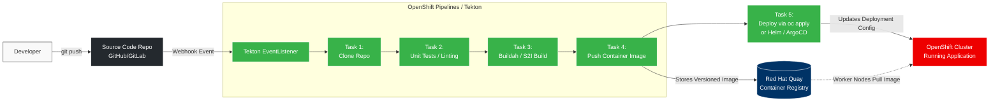

```mermaid
flowchart LR
    %% Styling
    classDef dev fill:#f9f9f9,stroke:#333
    classDef git fill:#24292e,stroke:#fff,color:#fff
    classDef tekton fill:#38b249,stroke:#fff,color:#fff
    classDef registry fill:#003366,stroke:#fff,color:#fff
    classDef deploy fill:#EE0000,stroke:#fff,color:#fff

    Dev[Developer]:::dev -->|git push| Git[Source Code Repo<br/>GitHub/GitLab]:::git
    Git -->|Webhook Event| Event[Tekton EventListener]:::tekton

    subgraph Tekton_Pipeline [OpenShift Pipelines / Tekton]
        direction LR
        Event --> Clone[Task 1:<br/>Clone Repo]:::tekton
        Clone --> Test[Task 2:<br/>Unit Tests / Linting]:::tekton
        Test --> Build[Task 3:<br/>Buildah / S2I Build]:::tekton
        Build --> Push[Task 4:<br/>Push Container Image]:::tekton
    end

    Push -->|Stores Versioned Image| Quay[(Red Hat Quay<br/>Container Registry)]:::registry
    Push --> Deploy[Task 5:<br/>Deploy via oc apply<br/>or Helm / ArgoCD]:::tekton

    Deploy -->|Updates Deployment Config| Cluster[OpenShift Cluster<br/>Running Application]:::deploy
    Quay -.->|Worker Nodes Pull Image| Cluster
```
