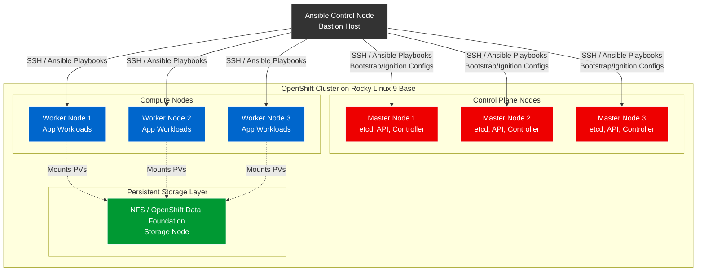

```mermaid
graph TD
    %% Styling
    classDef control fill:#333,stroke:#fff,color:#fff
    classDef master fill:#EE0000,stroke:#fff,color:#fff
    classDef worker fill:#0066cc,stroke:#fff,color:#fff
    classDef storage fill:#009933,stroke:#fff,color:#fff

    Bastion[Ansible Control Node<br/>Bastion Host]:::control

    subgraph Cluster [OpenShift Cluster on Rocky Linux 9 Base]
        
        subgraph Masters [Control Plane Nodes]
            M1[Master Node 1<br/>etcd, API, Controller]:::master
            M2[Master Node 2<br/>etcd, API, Controller]:::master
            M3[Master Node 3<br/>etcd, API, Controller]:::master
        end

        subgraph Workers [Compute Nodes]
            W1[Worker Node 1<br/>App Workloads]:::worker
            W2[Worker Node 2<br/>App Workloads]:::worker
            W3[Worker Node 3<br/>App Workloads]:::worker
        end

        subgraph Storage [Persistent Storage Layer]
            S1[NFS / OpenShift Data Foundation<br/>Storage Node]:::storage
        end
    end

    %% Deployment Flow
    Bastion -->|SSH / Ansible Playbooks<br/>Bootstrap/Ignition Configs| M1
    Bastion -->|SSH / Ansible Playbooks<br/>Bootstrap/Ignition Configs| M2
    Bastion -->|SSH / Ansible Playbooks<br/>Bootstrap/Ignition Configs| M3
    
    Bastion -->|SSH / Ansible Playbooks| W1
    Bastion -->|SSH / Ansible Playbooks| W2
    Bastion -->|SSH / Ansible Playbooks| W3

    %% Persistent Storage Attachment
    W1 -.->|Mounts PVs| S1
    W2 -.->|Mounts PVs| S1
    W3 -.->|Mounts PVs| S1
```
