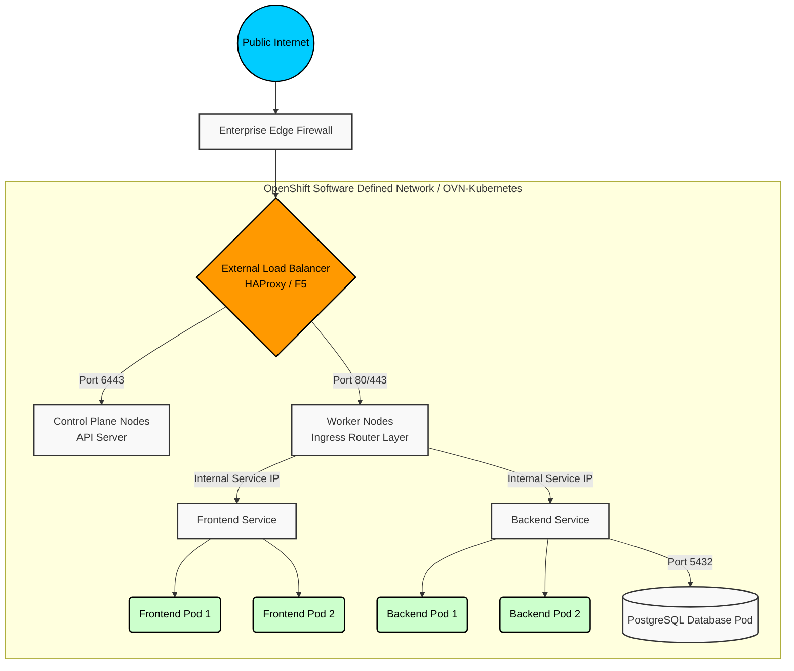

```mermaid
graph TD
    %% Styling
    classDef internet fill:#00ccff,stroke:#000,color:#000
    classDef lb fill:#ff9900,stroke:#000,color:#000
    classDef node fill:#f9f9f9,stroke:#333,stroke-width:2px
    classDef pod fill:#ccffcc,stroke:#000,color:#000

    Internet((Public Internet)):::internet --> Firewall[Enterprise Edge Firewall]
    
    Firewall --> ExtLB{External Load Balancer<br/>HAProxy / F5}:::lb

    subgraph OpenShift_SDN [OpenShift Software Defined Network / OVN-Kubernetes]
        %% Management Traffic
        ExtLB -->|Port 6443| API[Control Plane Nodes<br/>API Server]:::node
        
        %% Application Web Traffic
        ExtLB -->|Port 80/443| Ingress[Worker Nodes<br/>Ingress Router Layer]:::node

        %% Internal Routing
        Ingress -->|Internal Service IP| ServiceA[Frontend Service]
        Ingress -->|Internal Service IP| ServiceB[Backend Service]

        %% Pod Endpoints
        ServiceA --> PodA1(Frontend Pod 1):::pod
        ServiceA --> PodA2(Frontend Pod 2):::pod
        
        ServiceB --> PodB1(Backend Pod 1):::pod
        ServiceB --> PodB2(Backend Pod 2):::pod
        
        %% Database traffic
        ServiceB -->|Port 5432| DB[(PostgreSQL Database Pod)]:::node
    end
```
